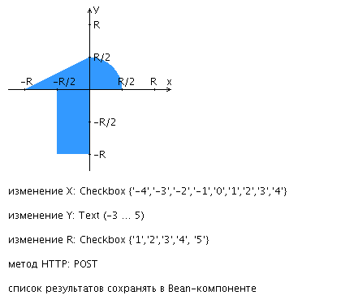

# se2-web-lab2 var. 3161
#### Результат: ...
Portbase: `31610`

Разработать веб-приложение на базе сервлетов и JSP, определяющее попадание точки на координатной плоскости в заданную область.

Приложение должно быть реализовано в соответствии с шаблоном MVC и состоять из следующих элементов:

1. ControllerServlet, определяющий тип запроса, и, в зависимости от того, содержит ли запрос информацию о координатах точки и радиусе, делегирующий его обработку одному из перечисленных ниже компонентов. Все запросы внутри приложения должны передаваться этому сервлету (по методу GET или POST в зависимости от варианта задания), остальные сервлеты с веб-страниц напрямую вызываться не должны.
2. AreaCheckServlet, осуществляющий проверку попадания точки в область на координатной плоскости и формирующий HTML-страницу с результатами проверки. Должен обрабатывать все запросы, содержащие сведения о координатах точки и радиусе области.
3. Страница JSP, формирующая HTML-страницу с веб-формой. Должна обрабатывать все запросы, не содержащие сведений о координатах точки и радиусе области.

Разработанная страница JSP должна содержать:
1. "Шапку", содержащую ФИО студента, номер группы и номер варианта.
2. Форму, отправляющую данные на сервер.
3. Набор полей для задания координат точки и радиуса области в соответствии с вариантом задания.
4. Сценарий на языке JavaScript, осуществляющий валидацию значений, вводимых пользователем в поля формы.
5. Интерактивный элемент, содержащий изображение области на координатной плоскости (в соответствии с вариантом задания) и реализующий следующую функциональность:
    - Если радиус области установлен, клик курсором мыши по изображению должен обрабатываться JavaScript-функцией, определяющей координаты точки, по которой кликнул пользователь и отправляющей полученные координаты на сервер для проверки факта попадания.
    - В противном случае, после клика по картинке должно выводиться сообщение о невозможности определения координат точки.
    - После проверки факта попадания точки в область изображение должно быть обновлено с учётом результатов этой проверки (т.е., на нём должна появиться новая точка).
6. Таблицу с результатами предыдущих проверок. Список результатов должен браться из контекста приложения, HTTP-сессии или Bean-компонента в зависимости от варианта.

Страница, возвращаемая AreaCheckServlet, должна содержать:
1. Таблицу, содержащую полученные параметры.
2. Результат вычислений - факт попадания или непопадания точки в область.
3. Ссылку на страницу с веб-формой для формирования нового запроса.

Разработанное веб-приложение необходимо развернуть на сервере WildFly. Сервер должен быть запущен в standalone-конфигурации, порты должны быть настроены в соответствии с выданным portbase, доступ к http listener'у должен быть открыт для всех IP.

#### Вопросы к защите лабораторной работы:
1. Java-сервлеты. Особенности реализации, ключевые методы, преимущества и недостатки относительно CGI и FastCGI.
1. Контейнеры сервлетов. Жизненный цикл сервлета.
1. Диспетчеризация запросов в сервлетах. Фильтры сервлетов.
1. HTTP-сессии - назначение, взаимодействие сервлетов с сессией, способы передачи идентификатора сессии.
1. Контекст сервлета - назначение, способы взаимодействия сервлетов с контекстом.
1. JavaServer Pages. Особенности, преимущества и недостатки по сравнению с сервлетами, область применения.
1. Жизненный цикл JSP.
1. Структура JSP-страницы. Комментарии, директивы, объявления, скриптлеты и выражения.
1. Правила записи Java-кода внутри JSP. Стандартные переменные, доступные в скриптлетах и выражениях.
1. Bean-компоненты и их использование в JSP.
1. Стандартные теги JSP. Использование Expression Language (EL) в JSP.
1. Параметры конфигурации JSP в дескрипторе развёртывания веб-приложения.
1. Шаблоны проектирования и архитектурные шаблоны. Использование в веб-приложениях.
1. Архитектура веб-приложений. Шаблон MVC. Архитектурные модели Model 1 и Model 2 и их реализация на платформе Java EE.